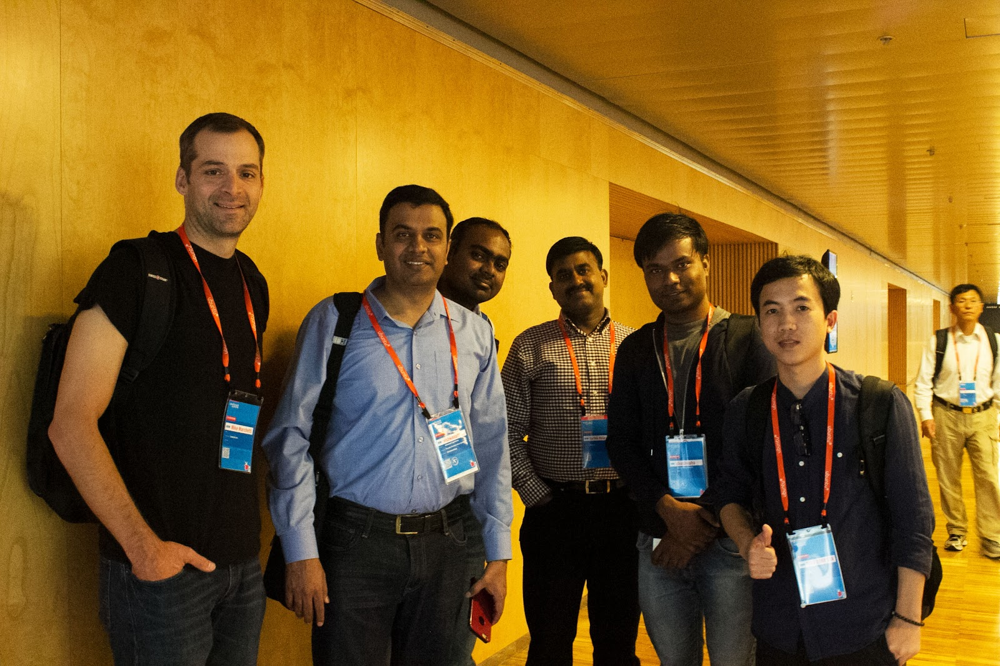

## Hi there 👋 I am Tung Doan

-  I’m currently working on cloud computing, NFV, and SDN
-  I am an open-source enthusiast/contributor. My code contributions in [OpenStack](https://review.opendev.org/q/owner:doantungbk.203@gmail.com+status:merged)
-  Working on OpenStack helps me gain more industry experience. I worked with developers worldwide such as Broadcom (formerly Brocade), Nokia, and NEC  :arrow_right:
-  I created and developed [APMEC](https://wiki.openstack.org/wiki/Apmec), a open-source management and orchestration (MANO) project in OpenStack for edge clouds, which later secured funding
-  I got my Ph.D at the [ComNets chair](https://cn.ifn.et.tu-dresden.de/), TU Dresden, Germany
-  I applied my research to build cool demos about autonomous driving and showcased them at the [CES summit 2020](https://www.youtube.com/watch?v=wYuWryNsN94) and the [IEEE NFV-SDN 2023](https://www.youtube.com/watch?v=ivJq17EnKUE)
-  How to reach me: [Github](https://github.com/doantungbk), [LinkedIn](https://www.linkedin.com/in/tung-doan-569770b1/)

